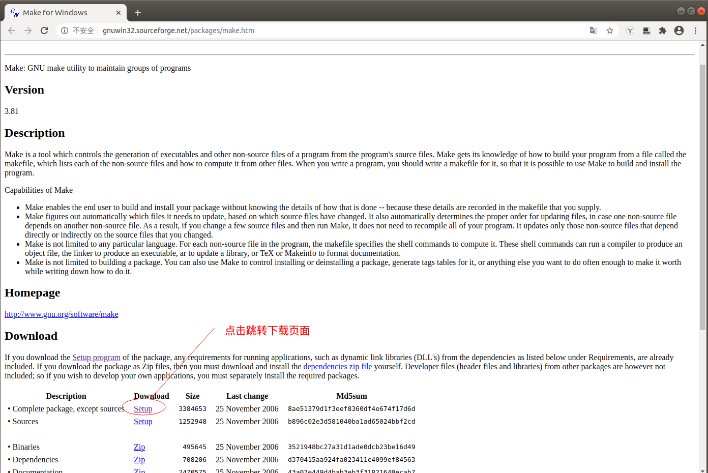
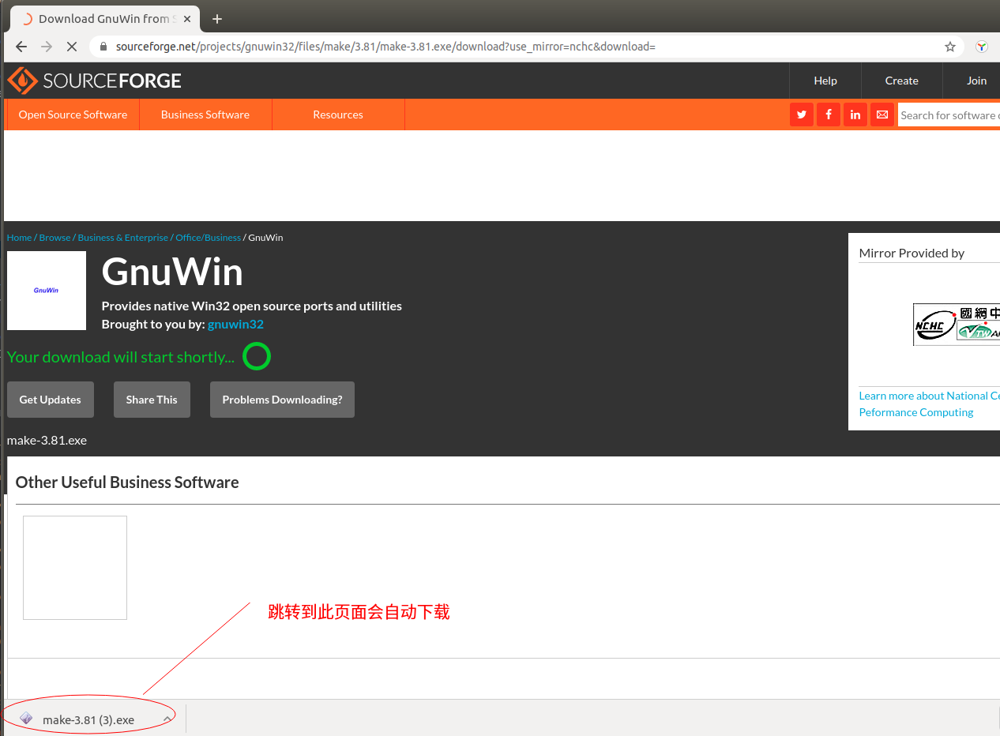
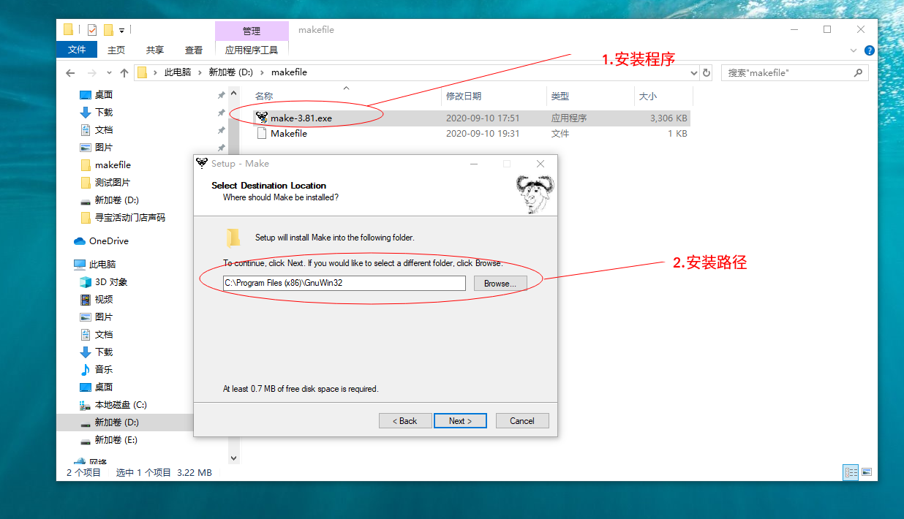
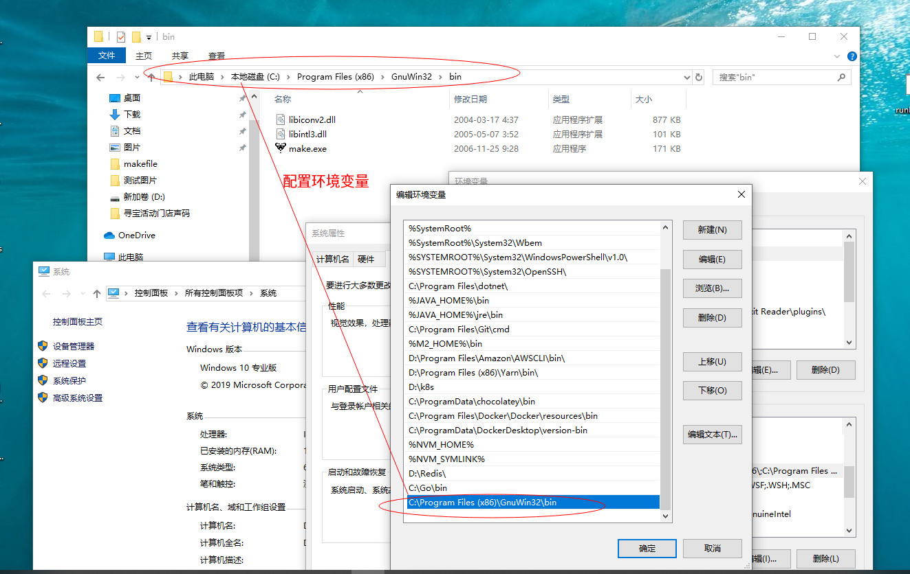
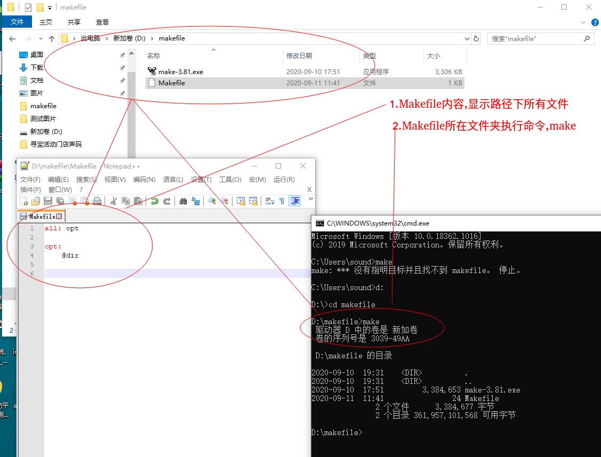
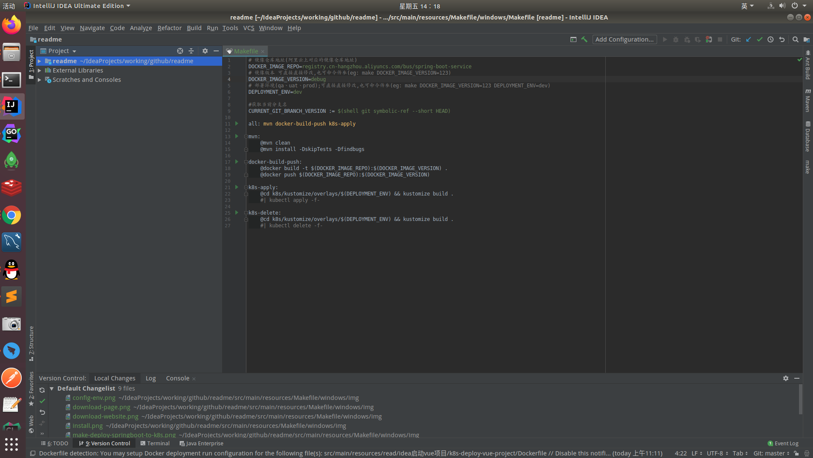
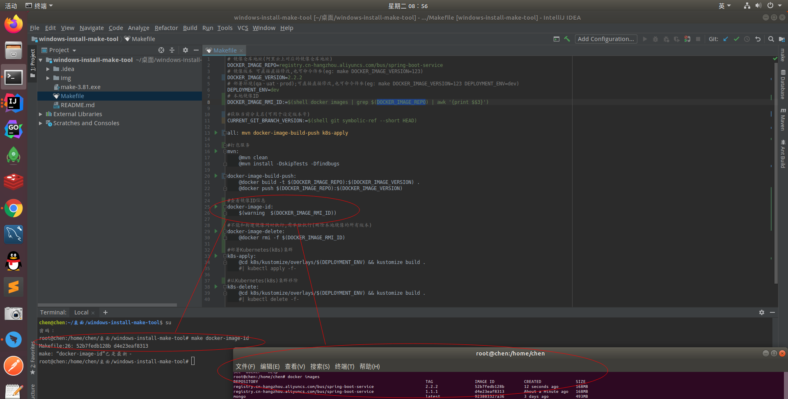
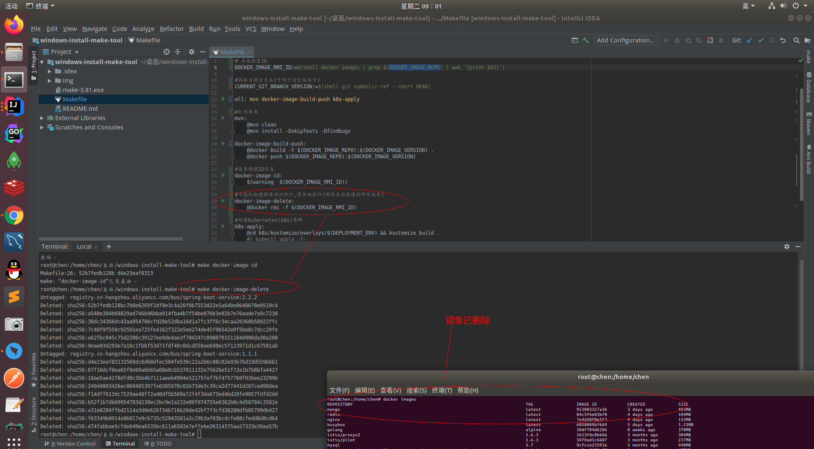

## windows系统使用`make工具`

Makefile文件传递控制命令到make工具,make工具执行命令.

1.`下载make工具`
windows上make工具[下载](http://gnuwin32.sourceforge.net/packages/make.htm) 

2.`安装&配置`
运行安装包『make-3.81.exe』安装,完成后配置环境变量即可全局使用.

3.`执行make命令`
创建Makefile文件,添加命令;在Makefile文件所在文件夹执行make命令.

4.`应用示例`

4.1使用Makefile执行命令,将Java spring boot服务构建Docker镜像、上传阿里云镜像仓库、部署k8s容器服务

makefile删除构建的镜像命令

